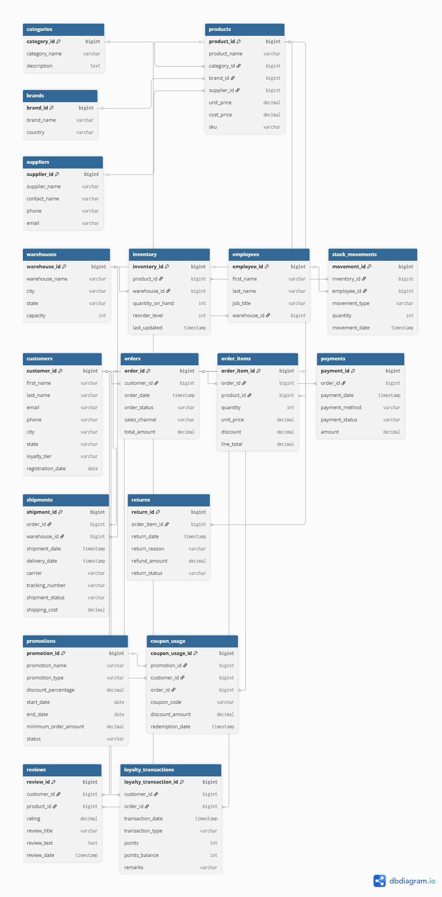
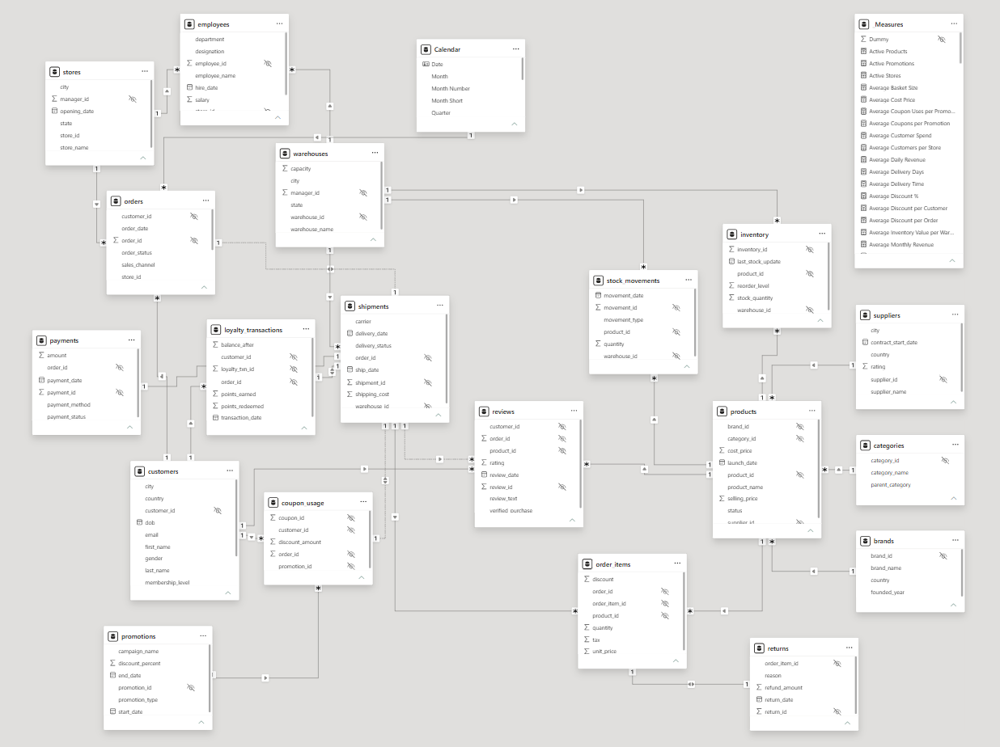

# 🛒 RetailHub Business Intelligence & Analytics Platform

> An end-to-end Business Intelligence solution built using **PostgreSQL** and **Power BI** to transform retail data into actionable business insights through data warehousing, advanced SQL, interactive dashboards, and business analytics.

<p align="center">


</p>

---

# 📌 Project Overview

RetailHub Business Intelligence & Analytics Platform is a complete end-to-end Business Intelligence project designed to simulate a real-world retail analytics environment.

The project demonstrates the complete lifecycle of a Business Intelligence solution, beginning with raw retail datasets, transforming them into a structured PostgreSQL data warehouse, and finally creating interactive Power BI dashboards for executive reporting and business decision-making.

Unlike dashboard-only projects, this project covers every stage of the analytics pipeline including:

- Database Design
- Data Warehousing
- SQL Development
- Data Cleaning
- Data Modeling
- Business KPI Development
- DAX Calculations
- Interactive Dashboard Design
- Business Insights Generation

The primary objective of this project is to demonstrate practical skills required for Data Analyst, Business Intelligence Analyst, and Data Engineer roles.

---

# 🎯 Problem Statement

Retail businesses generate massive amounts of transactional data every day. However, without proper organization and reporting, this data provides little value for decision-makers.

Business teams often struggle to answer questions such as:

- Which products generate the highest revenue?
- Which stores perform the best?
- Which promotions are effective?
- How profitable is the business?
- Which customers contribute the most revenue?
- How efficiently is inventory managed?
- How do shipping operations impact customer satisfaction?
- Which financial metrics require immediate attention?

The objective of this project is to centralize retail data into a scalable Business Intelligence platform capable of answering these questions through interactive analytics.

---

# 🎯 Business Objectives

The Business Intelligence platform was designed to help stakeholders:

- Monitor overall business performance
- Analyze sales trends over time
- Evaluate customer purchasing behavior
- Measure product profitability
- Monitor inventory movement
- Evaluate shipping efficiency
- Analyze promotional campaign performance
- Track financial performance
- Compare store performance across locations
- Support data-driven business decisions

---

# 🏗️ Project Architecture

The project follows a complete Business Intelligence workflow.

```text
                    Raw Retail Dataset
                           │
                           ▼
                  Data Cleaning (Excel)
                           │
                           ▼
                  PostgreSQL Database
                           │
                           ▼
                 Data Warehouse Design
                           │
                           ▼
                SQL Development Layer
        (Views, Functions, Procedures, Triggers)
                           │
                           ▼
                  Power BI Data Model
                           │
                           ▼
                   Power Query ETL
                           │
                           ▼
                    DAX Measure Layer
                           │
                           ▼
                 Interactive Dashboards
                           │
                           ▼
              Business Insights & Reporting
```

---

# 🛠️ Technology Stack

| Category | Technologies |
|----------|--------------|
| Database | PostgreSQL |
| Query Language | SQL |
| BI Tool | Microsoft Power BI |
| ETL | Power Query |
| Analytics | DAX |
| Data Source | Microsoft Excel |
| Version Control | Git & GitHub |

---

# ⭐ Key Features

### Database Development

- Designed a normalized PostgreSQL retail database
- Implemented 19 relational tables
- Applied primary and foreign key constraints
- Added check constraints and default values
- Optimized queries using indexes

### SQL Development

- Complex SQL Queries
- Common Table Expressions (CTEs)
- Window Functions
- Aggregate Functions
- Stored Procedures
- User Defined Functions
- Views
- Materialized Views
- Triggers

### Power BI Development

- Power Query data transformation
- Star schema data model
- Calendar table
- Dedicated DAX measure table
- Advanced KPI calculations
- Interactive filtering
- Drill-down analysis
- Enterprise dashboard design

### Business Analytics

- Executive Reporting
- Sales Analytics
- Customer Analytics
- Product Analytics
- Inventory Analytics
- Shipping Analytics
- Promotion Analytics
- Financial Analytics
- Store Performance Analytics

---

# 📊 Dashboards Included

The Power BI report consists of **9 interactive dashboards**.

| Dashboard | Purpose |
|-----------|---------|
| 📈 Executive Dashboard | High-level business overview |
| 🛒 Sales Dashboard | Sales trends and revenue analysis |
| 👥 Customer Dashboard | Customer behavior and segmentation |
| 📦 Product Dashboard | Product performance and profitability |
| 🏪 Store Dashboard | Store-wise business performance |
| 🚚 Shipping Dashboard | Delivery and logistics analysis |
| 📢 Promotion Dashboard | Promotion and discount effectiveness |
| 💰 Financial Dashboard | Revenue, profit, and financial KPIs |
| 📋 Inventory Dashboard | Inventory tracking and stock monitoring |

---

# 📂 Project Structure

```text
RetailHub-Business-Intelligence-Analytics-Platform/
│
├── Dashboard/
│   └── RetailHub_Analytics_Dashboard.pbix
│
├── Dataset/
│   ├── brands.xlsx
│   ├── categories.xlsx
│   ├── coupon_usage.xlsx
│   ├── customers.xlsx
│   ├── inventory.xlsx
│   ├── order_items.xlsx
│   ├── orders.xlsx
│   ├── payments.xlsx
│   ├── products.xlsx
│   ├── promotions.xlsx
│   ├── reviews.xlsx
│   ├── shipments.xlsx
│   ├── stores.xlsx
│   ├── suppliers.xlsx
│   ├── warehouses.xlsx
│   └── ... (remaining datasets)
│
├── SQL/
│   ├── Database Creation.sql
│   ├── Table Creation.sql
│   ├── Constraints.sql
│   ├── Views.sql
│   ├── Materialized Views.sql
│   ├── Functions.sql
│   ├── Stored Procedures.sql
│   ├── Triggers.sql
│   ├── Indexes.sql
│   ├── Analytics Queries.sql
│   └── Security.sql
│
├── Documentation/
│   ├── ER_Diagram.pdf
│   ├── Data_Dictionary.pdf
│   ├── Business_Insights.pdf
│   └── Dashboard_Guide.pdf
│
├── Dashboard_Screenshots/
│   ├── Executive.png
│   ├── Sales.png
│   ├── Customer.png
│   ├── Product.png
│   ├── Inventory.png
│   ├── Shipping.png
│   ├── Promotion.png
│   ├── Financial.png
│   └── Store.png
│
└── README.md
```

---

# 🗄️ Database Design

The RetailHub database was designed as a normalized relational database to ensure data integrity, minimize redundancy, and support efficient analytical queries.

The database serves as the foundation of the Business Intelligence platform and stores information related to customers, orders, products, inventory, suppliers, stores, promotions, shipping, and financial transactions.

The design follows relational database best practices using PostgreSQL.

---

# 📊 Data Warehouse Overview

The project contains **19 interconnected tables** representing different business entities.

The data warehouse includes both transactional (fact) data and descriptive (dimension) data, enabling efficient reporting and business analysis.

Major business domains covered include:

- Customer Management
- Product Management
- Inventory Management
- Sales & Orders
- Payment Processing
- Shipping & Logistics
- Promotions & Coupons
- Store Operations
- Supplier Management
- Financial Reporting

---

# 🧩 Database Tables

| Table | Description |
|--------|-------------|
| Brands | Product brand information |
| Categories | Product categories and hierarchy |
| Coupon Usage | Coupon redemption history |
| Customers | Customer master data |
| Employees | Employee information |
| Inventory | Product stock availability |
| Order Items | Line items for each order |
| Orders | Customer order transactions |
| Payments | Payment details and status |
| Products | Product catalog |
| Promotions | Promotional campaigns and discounts |
| Reviews | Product ratings and customer feedback |
| Shipments | Shipping and delivery information |
| Stores | Store locations and management |
| Suppliers | Supplier information |
| Warehouses | Warehouse details |
| Returns | Returned orders *(if included in your model)* |
| Purchase Orders | Inventory procurement *(if included)* |
| Stock Movements | Inventory movement history *(if included)* |

---

# 🔗 Database Relationships

The database follows a relational model using Primary Keys and Foreign Keys.

Examples include:

- Customers → Orders
- Orders → Order Items
- Products → Categories
- Products → Brands
- Products → Suppliers
- Inventory → Warehouses
- Orders → Payments
- Orders → Shipments
- Promotions → Coupon Usage
- Stores → Orders

This relational design enables complex analytical queries while maintaining referential integrity.

---

# 🔒 Database Constraints

To ensure data quality and consistency, multiple constraints were implemented throughout the database.

Implemented constraints include:

- Primary Keys
- Foreign Keys
- NOT NULL Constraints
- UNIQUE Constraints
- CHECK Constraints
- DEFAULT Values
- Identity Columns

These constraints help prevent duplicate, incomplete, and invalid data from entering the system.

---

# ⚡ Query Optimization

To improve query performance, several optimization techniques were implemented.

These include:

- Index creation on frequently queried columns
- Optimized JOIN strategies
- Aggregate query optimization
- Efficient filtering
- Reduced redundant calculations
- Performance-oriented SQL design

These optimizations significantly improve reporting performance for large datasets.

---

# 👁️ Database Views

Multiple SQL Views were created to simplify reporting and reduce query complexity.

Views were used to:

- Combine frequently joined tables
- Simplify business reporting
- Improve code reusability
- Reduce repetitive SQL queries

---

# 📦 Materialized Views

Materialized Views were implemented for analytical reports that require complex aggregations.

Benefits include:

- Faster dashboard queries
- Reduced execution time
- Pre-computed aggregations
- Improved reporting performance

---

# ⚙️ User Defined Functions

Several reusable SQL Functions were created to encapsulate common business logic.

Functions were used for:

- Revenue calculations
- Profit calculations
- Customer metrics
- Sales analytics
- Date-based calculations

This improved maintainability and reduced repeated SQL code.

---

# 🔄 Stored Procedures

Stored Procedures automate repetitive database operations and improve consistency.

Procedures include logic for:

- Data updates
- Inventory management
- Sales processing
- Reporting operations
- Administrative tasks

Using stored procedures keeps business logic centralized inside the database.

---

# 🚨 Database Triggers

Triggers were implemented to automatically execute business rules whenever specific database events occur.

Examples include:

- Automatic inventory updates after order placement
- Audit logging
- Timestamp updates
- Data validation
- Stock synchronization

These automated processes reduce manual intervention and improve data consistency.

---

# 🔐 Security

Basic database security measures were implemented to demonstrate secure database practices.

Security implementation includes:

- Role-based access control
- User privilege management
- Controlled access to database objects
- Secure SQL development practices

---

# 💡 SQL Concepts Demonstrated

This project demonstrates practical usage of advanced SQL concepts commonly used in enterprise environments.

- Database Design
- Normalization
- Joins
- Aggregate Functions
- GROUP BY
- HAVING
- Subqueries
- Common Table Expressions (CTEs)
- Window Functions
- CASE Statements
- Views
- Materialized Views
- Stored Procedures
- User Defined Functions
- Triggers
- Indexing
- Query Optimization
- Security & Roles

# 📈 Power BI Development

The reporting layer of the RetailHub Business Intelligence Platform was developed using **Microsoft Power BI Desktop**.

The objective was to transform relational data into an interactive reporting solution that enables business users to monitor KPIs, analyze trends, and make informed decisions.

The development process followed industry-standard Business Intelligence practices, including data preparation, data modeling, DAX calculations, and dashboard design.

---

# 🔄 Data Import & Power Query (ETL)

All datasets were imported into Power BI and transformed using **Power Query Editor** before loading into the data model.

The ETL process included:

- Importing all retail datasets
- Renaming columns for consistency
- Verifying data types
- Handling missing values
- Removing duplicate records
- Formatting date columns
- Standardizing text values
- Removing unnecessary columns
- Optimizing data for reporting

Power Query ensured that only clean and reliable data entered the analytical model.

---

# ⭐ Data Modeling

A relational data model was built inside Power BI to mirror the PostgreSQL database structure.

The model follows a **Star Schema**, where transactional tables connect to descriptive dimension tables.

The model includes relationships between:

- Orders
- Order Items
- Customers
- Products
- Categories
- Brands
- Stores
- Suppliers
- Warehouses
- Promotions
- Coupon Usage
- Payments
- Shipments
- Inventory
- Calendar Table

Proper one-to-many relationships were established to support efficient filtering and accurate calculations.

---

# 📅 Calendar Table

A dedicated Calendar Table was created to support time intelligence and reporting.

The calendar table enables:

- Year analysis
- Quarter analysis
- Monthly trends
- Date hierarchy
- Time-based filtering

The following attributes were included:

- Date
- Day
- Month
- Month Name
- Quarter
- Year
- Week Number

This allows consistent reporting across every dashboard.

---

# 📊 DAX Measure Table

A dedicated **Measures Table** was created to centralize all business calculations.

Measures were organized into display folders to improve maintainability and navigation.

Major categories include:

- Sales KPIs
- Customer KPIs
- Product KPIs
- Financial KPIs
- Inventory KPIs
- Shipping KPIs
- Promotion KPIs
- Advanced Analytics

Organizing measures separately keeps the data model clean and follows Power BI best practices.

---

# 📌 Key Business KPIs

The project includes a comprehensive collection of business metrics used throughout the dashboards.

Examples include:

### Sales KPIs

- Gross Revenue
- Net Revenue
- Total Orders
- Average Order Value
- Sales Growth
- Revenue Trend

### Customer KPIs

- Total Customers
- New Customers
- Repeat Customers
- Customer Lifetime Value
- Customer Retention

### Product KPIs

- Products Sold
- Product Revenue
- Product Profit
- Active Products
- Average Product Rating

### Financial KPIs

- Gross Profit
- Net Profit
- Profit Margin
- Total Refund Amount

### Inventory KPIs

- Inventory Value
- Inventory Turnover
- Low Stock Products
- Average Stock Level

### Shipping KPIs

- Total Shipments
- Delivered Shipments
- Delivery Success Rate
- Average Delivery Time

### Promotion KPIs

- Total Promotions
- Coupon Usage
- Total Discount Given
- Average Discount Percentage

---

# 🎨 Dashboard Design Principles

Each dashboard was designed with usability and business decision-making in mind.

Design principles followed include:

- Consistent layout across all pages
- KPI cards positioned at the top
- Interactive slicers
- Cross-filtering between visuals
- Consistent color palette
- Minimal visual clutter
- Business-friendly visual hierarchy
- Responsive report navigation

The dashboards prioritize clarity while allowing users to perform detailed business analysis.

---

# ⚡ Performance Optimization

Several optimization techniques were applied to improve report performance.

These include:

- Efficient relationship design
- Optimized DAX measures
- Removing unused columns
- Reducing unnecessary calculated columns
- Using a dedicated measure table
- Applying proper data types
- Simplifying report interactions where appropriate

These optimizations ensure smooth report performance even with multiple interactive dashboards.

# 💡 Business Insights & Key Findings

The RetailHub Business Intelligence Platform enables stakeholders to transform raw retail data into meaningful business insights.

By integrating data across customers, products, stores, inventory, logistics, promotions, and finance, the dashboards help identify opportunities, monitor performance, and support strategic decision-making.

---

# 📈 Executive Insights

The Executive Dashboard provides a consolidated view of organizational performance.

Decision-makers can:

- Monitor overall business growth
- Track revenue and profitability trends
- Compare monthly business performance
- Identify high-performing product categories
- Analyze order distribution across different statuses
- Monitor overall operational health using key performance indicators

---

# 🛒 Sales Insights

The Sales Dashboard helps analyze revenue generation and sales performance.

Business users can:

- Identify top-selling products
- Monitor monthly sales trends
- Compare category-wise revenue
- Evaluate sales performance across stores
- Track average order value
- Detect seasonal demand patterns

---

# 👥 Customer Insights

Customer analytics help understand purchasing behavior and customer engagement.

Key business questions answered include:

- Who are the highest-value customers?
- Which customer segments generate maximum revenue?
- How many repeat customers does the business have?
- How does membership level influence spending?
- Which locations contribute the most customers?

These insights support customer retention and loyalty strategies.

---

# 📦 Product Insights

The Product Dashboard focuses on product performance and profitability.

Business users can:

- Identify best-selling products
- Compare category performance
- Evaluate brand performance
- Monitor product ratings
- Track active and inactive products
- Analyze product-level profitability

These insights assist in pricing, inventory planning, and product portfolio optimization.

---

# 🏪 Store Insights

The Store Dashboard enables performance comparison across retail locations.

Management can:

- Compare store revenue
- Evaluate profitability by store
- Analyze order volume
- Measure average order value
- Identify top-performing and underperforming stores

These insights help optimize regional operations and resource allocation.

---

# 🚚 Shipping Insights

Shipping analytics provide visibility into logistics performance.

Business users can:

- Monitor shipment volumes
- Track delivery success rates
- Analyze average delivery time
- Compare carrier performance
- Evaluate shipping costs
- Identify operational bottlenecks

These insights contribute to improved customer satisfaction and logistics planning.

---

# 📋 Inventory Insights

Inventory analytics support effective stock management.

The dashboard helps identify:

- Current inventory levels
- Low-stock products
- Inventory value
- Warehouse utilization
- Stock distribution
- Inventory turnover

This enables better replenishment planning and minimizes stock shortages.

---

# 📢 Promotion Insights

Promotion analytics evaluate the effectiveness of marketing campaigns.

The dashboard provides visibility into:

- Promotion activity
- Coupon redemption
- Discount distribution
- Campaign performance
- Promotion types
- Customer participation

These insights support future promotional planning and marketing optimization.

---

# 💰 Financial Insights

The Financial Dashboard provides a comprehensive view of business profitability.

Decision-makers can monitor:

- Gross Revenue
- Net Revenue
- Gross Profit
- Net Profit
- Profit Margin
- Refund Impact
- Revenue trends
- Category profitability

These insights support budgeting, financial planning, and executive reporting.

---

# 🎯 Business Value

The platform enables business users to answer critical questions such as:

- Which products generate the highest revenue?
- Which stores perform the best?
- Which customers contribute the most profit?
- Which product categories should receive more investment?
- How effectively are promotions driving sales?
- Is inventory being managed efficiently?
- How do shipping operations impact customer experience?
- Which financial metrics require immediate attention?

By providing answers to these questions through interactive dashboards, the platform supports faster and more informed business decisions.

---

# 🚀 Skills Demonstrated

This project demonstrates practical skills across multiple domains of Business Intelligence and Data Analytics.

### Database & SQL

- Database Design
- Data Warehousing
- PostgreSQL
- Advanced SQL
- Joins
- CTEs
- Window Functions
- Views
- Materialized Views
- Stored Procedures
- User Defined Functions
- Triggers
- Indexing
- Query Optimization

### Business Intelligence

- Microsoft Power BI
- Power Query
- Data Modeling
- Star Schema
- Calendar Table
- DAX
- KPI Development
- Interactive Dashboards
- Business Reporting

### Data Analytics

- Business Analysis
- KPI Design
- Trend Analysis
- Performance Monitoring
- Financial Analytics
- Customer Analytics
- Sales Analytics
- Inventory Analytics
- Store Analytics
- Logistics Analytics

### Professional Skills

- Data Visualization
- Dashboard Design
- Business Storytelling
- Decision Support
- Analytical Thinking
- Problem Solving

---

# 📚 Learning Outcomes

This project provided practical experience in developing an end-to-end Business Intelligence solution.

Key learnings include:

- Designing a normalized relational database
- Building a scalable PostgreSQL data warehouse
- Writing advanced SQL queries for analytics
- Creating reusable database objects
- Transforming raw data using Power Query
- Designing an efficient Power BI data model
- Developing advanced DAX measures
- Creating interactive dashboards for multiple business domains
- Translating business requirements into analytical solutions
- Presenting insights through effective data visualization

---

# 🚀 Getting Started

Follow these steps to set up the RetailHub Business Intelligence & Analytics Platform on your local machine.

## Prerequisites

Ensure the following software is installed:

- PostgreSQL 16+ (or compatible version)
- pgAdmin 4 (Optional)
- Microsoft Power BI Desktop
- Microsoft Excel
- Git

---

# ⚙️ Installation

### 1. Clone the Repository

```bash
git clone https://github.com/yourusername/retailhub-business-intelligence-analytics-platform.git
```

Move into the project directory.

```bash
cd retailhub-business-intelligence-analytics-platform
```

---

### 2. Create the PostgreSQL Database

Create a new PostgreSQL database.

Example:

```sql
CREATE DATABASE retailhub_dw;
```

---

### 3. Execute SQL Scripts

Run the SQL scripts in the following order:

1. Database Creation
2. Table Creation
3. Constraints
4. Indexes
5. Views
6. Materialized Views
7. Functions
8. Stored Procedures
9. Triggers
10. Analytics Queries
11. Security

---

### 4. Load the Dataset

Import the provided Excel datasets into the corresponding PostgreSQL tables.

Ensure all data has been successfully imported before opening the Power BI report.

---

### 5. Open Power BI

Open

```
RetailHub_Analytics_Dashboard.pbix
```

---

### 6. Update Data Source

Update the PostgreSQL connection if required.

Example:

- Server
- Database
- Username
- Password

Refresh the report.

---

### 7. Explore the Dashboards

Navigate through the dashboards using the report navigation.

Use slicers and filters to explore different business scenarios.

---

# 📂 Dataset Information

The project uses a retail business dataset representing multiple operational domains.

The dataset includes information related to:

- Customers
- Orders
- Products
- Categories
- Brands
- Stores
- Employees
- Warehouses
- Inventory
- Payments
- Shipments
- Promotions
- Coupon Usage
- Reviews
- Suppliers

The data was cleaned and transformed before being used for reporting and analytics.

---

# 🎯 Use Cases

This project can be used for:

- Business Intelligence Portfolio
- Data Analyst Portfolio
- SQL Portfolio
- Power BI Portfolio
- BI Interview Preparation
- Dashboard Design Reference
- PostgreSQL Practice
- DAX Practice
- Power Query Practice
- Retail Analytics Learning

---

# 🔮 Future Improvements

Potential enhancements for future versions include:

- Real-time dashboard refresh
- Row-Level Security (RLS)
- Power BI Service deployment
- Automated ETL pipelines
- Incremental refresh
- Forecasting using Power BI
- Machine Learning integration
- Customer segmentation using clustering
- Demand forecasting
- Mobile dashboard optimization
- KPI alerts
- Executive scorecards

---

# 🤝 Contributing

Contributions, suggestions, and improvements are welcome.

If you find an issue or have ideas for enhancements:

1. Fork the repository.
2. Create a new feature branch.
3. Commit your changes.
4. Open a Pull Request.

---

# 📄 License

This project is licensed under the MIT License.

You are free to use, modify, and distribute this project with proper attribution.

---

# 👨‍💻 Author

**Akshat**

B.Tech Information Technology

Aspiring Data Analyst | Business Intelligence Analyst | AI & Data Enthusiast

### Connect with Me

- LinkedIn: *(Add your LinkedIn profile URL)*
- GitHub: *(Add your GitHub profile URL)*
- Email: *(Add your professional email)*

---

# 🙏 Acknowledgements

Special thanks to the open-source community and Microsoft documentation for providing excellent learning resources on PostgreSQL, SQL, and Power BI.

This project was built as a hands-on learning experience to strengthen practical skills in Business Intelligence, Data Analytics, and Data Engineering.

---

# Entity Relationship Diagram



# Power BI Data Model




## 📈 Executive Dashboard


---

## 🛒 Sales Dashboard


---

## 👥 Customer Dashboard


---

## 📦 Product Dashboard


---

## 📋 Inventory Dashboard


---

## 🚚 Shipping Dashboard


---

## 📢 Promotion Dashboard


---

## 💰 Financial Dashboard


---

## 🏪 Store Dashboard


# ⭐ Support

If you found this project useful:

⭐ Star this repository

🍴 Fork it

📢 Share it with others

Your support motivates further development of high-quality open-source analytics projects.

---

## 📬 Feedback

Feedback and suggestions are always welcome.

If you have any questions or recommendations, feel free to open an issue or connect with me on LinkedIn.

---

<div align="center">

### ⭐ If you found this project helpful, please consider giving it a Star ⭐

**Thank you for visiting this repository!**

</div>
